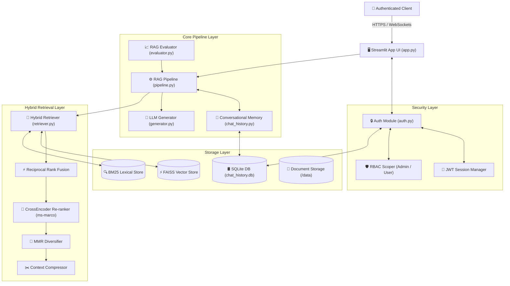
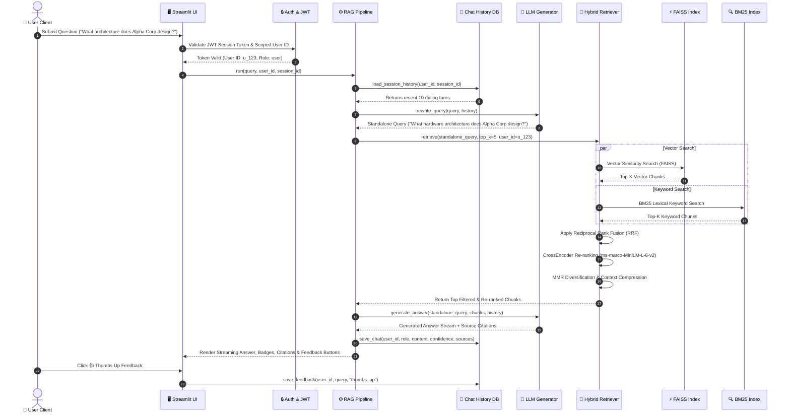
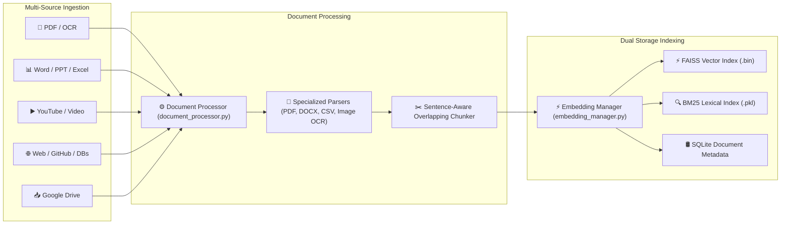

# 🏛️ System Architecture & Engineering Specifications

This document details the software architecture, component relationships, query execution sequence, ingestion data flow, and repository organization of the **DocuMind AI Enterprise Document Intelligence System**.

---

## 🧩 1. Component Diagram

The system follows a decoupled, modular architecture comprising five primary layers: **UI Layer**, **Security & Auth Layer**, **RAG Orchestration Layer**, **Retrieval & Embedding Layer**, and the **Persistence Storage Layer**.



---

## 🔄 2. Query Execution Sequence Diagram

The sequence diagram below traces a user query from submission to LLM answer generation, source citation, and feedback recording.



---

## 🌊 3. Ingestion & Data Flow Diagram

Demonstrates how documents from 13 enterprise sources are parsed, chunked, embedded, and stored across FAISS and BM25 indexes.



---

## 📂 4. Repository Directory Structure

```
Ai_Document_Intelligence_System/
├── .github/
│   └── workflows/
│       └── ci-cd.yml              # GitHub Actions CI/CD Pipeline
├── docs/                          # Comprehensive Documentation Suite
│   ├── ARCHITECTURE.md            # System Architecture & Mermaid Diagrams
│   ├── API_DOCUMENTATION.md       # Python API Specifications
│   ├── DEVELOPER_GUIDE.md         # Developer Setup & Testing Guide
│   ├── USER_GUIDE.md              # End-User UI Manual
│   ├── TROUBLESHOOTING.md         # Diagnostic & Fix Handbook
│   └── FUTURE_SCOPE.md            # Product Roadmap & Architectural Next Steps
├── nginx/
│   └── nginx.conf                 # Nginx SSL Reverse Proxy & Rate Limiting
├── src/                           # Primary Application Source Code
│   ├── connectors/                # Enterprise Source Connectors
│   │   ├── drive_connector.py     # Google Drive API Integrator
│   │   ├── github_connector.py    # GitHub Repository Parser
│   │   ├── table_connector.py     # SQL Database & Structured Table Connector
│   │   ├── web_crawler.py         # Web Crawling & Scraping Connector
│   │   └── youtube_connector.py   # YouTube Transcript & Video Audio Parser
│   ├── core/                      # Engine Infrastructure
│   │   ├── auth.py                # User Authentication, Password Salting & JWT
│   │   ├── chat_history.py        # SQLite Persistence, Session Memory & Feedback
│   │   ├── config.py              # System Configuration & Path Constants
│   │   ├── embedding_manager.py   # PyTorch SentenceTransformers & FAISS Engine
│   │   ├── logger.py              # Structured System Logging Infrastructure
│   │   └── pipeline.py            # RAG Pipeline Orchestrator with Latency Metrics
│   ├── evaluation/
│   │   └── evaluator.py           # 10-Metric Quantitative Benchmark Evaluator
│   ├── ingestion/
│   │   └── document_processor.py  # Master Ingestion Router
│   ├── llm/
│   │   ├── base.py                # Abstract LLM Interface
│   │   ├── generator.py           # LLM Response Generator & Standalone Rewriter
│   │   └── groq_client.py         # Groq Llama-3 API Engine Client
│   ├── ocr/
│   │   └── tesseract_ocr.py       # Image OCR Text Extraction Engine
│   ├── parsers/                   # Document Format Parsers
│   │   ├── base.py                # Base Parser Contract
│   │   ├── docx_parser.py         # MS Word (.docx) Parser
│   │   ├── html_parser.py         # HTML & Web Document Parser
│   │   ├── markdown_parser.py     # Markdown (.md) Parser
│   │   ├── pdf_parser.py          # PDF Parser (pypdf + pdf2image fallback)
│   │   ├── pptx_parser.py         # MS PowerPoint (.pptx) Parser
│   │   ├── spreadsheet_parser.py  # Excel & CSV (.xlsx, .csv) Parser
│   │   └── text_parser.py         # Plain Text (.txt) Parser
│   └── retrieval/
│       ├── keyword_search.py      # BM25 Lexical Keyword Engine
│       └── retriever.py           # Upgraded Hybrid Retriever (RRF, CrossEncoder, MMR)
├── ui/
│   └── app.py                     # Streamlit Enterprise Interface
├── .dockerignore                  # Excluded Docker Build Files
├── .env.example                   # Environment Configuration Template
├── DEPLOYMENT.md                  # Docker & NVIDIA GPU Setup Guide
├── docker-compose.yml             # Local Docker Compose Orchestration
├── docker-compose.prod.yml        # Production Nginx + Certbot Docker Compose
├── Dockerfile                     # Multi-stage Container Buildfile
├── PRODUCTION_DEPLOYMENT.md       # Multi-Cloud & HTTPS Deployment Handbook
├── railway.json                   # Railway PaaS Deployment Manifest
├── render.yaml                    # Render PaaS Deployment Blueprint
└── pyproject.toml                 # Python Package Metadata & Dependencies
```
